# portfolio.ladell.dev

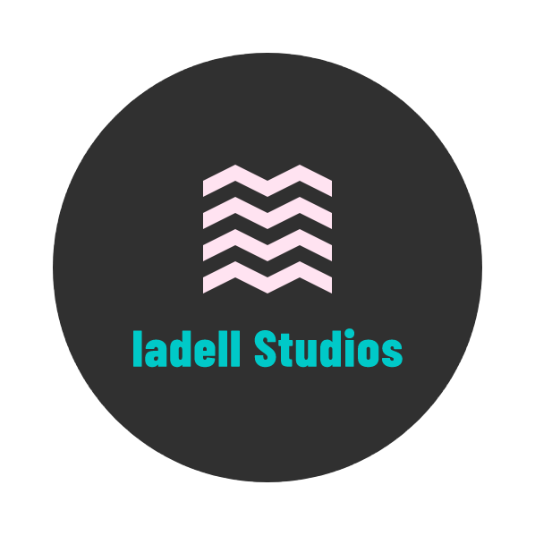

[Check it out here!](https://portfolio.ladell.dev)

[Github Repo](https://github.com/en3on/ladell-dev-portfolio)

## Why portfolio.ladell.dev?
portfolio.ladell.dev was created to showcase the projects I am working and have worked on. It is intended to be viewed by potential employers and other curious individuals in the tech industry.

I have chosen to use a full screen landing section with a minimalistic look using a background image sourced from [unsplash](https://unsplash.com) and an animated title displaying my name.

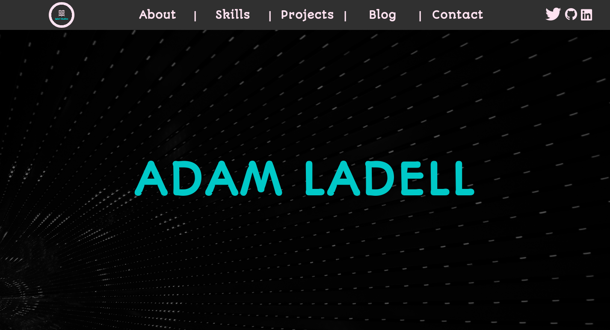

The URL was chosen to be a **subdomain**, as I am planning for future expansion of the **ladell.dev** domain as a store section for my future commercial releases as well as the **blog.ladell.dev** subdomain that will be used to journal my programming journey.

### DESKTOP SPECIFICS

#### Navbar

portfolio.ladell.dev uses a fixed navbar system to allow users to access any part of the section at any time.

The navbar has been implemeneted as a grid with 1 row and 3 columns of varying sizes.  
Each grid division is set as a flexbox to allow responsive centering of the elements inside.

The three sections of the navbar include:
* **Logo**  
The logo is placed on the left-most side of the navbar. The logo is also a link that takes you to [ladell.dev](https://ladell.dev).

* **Navigation Links**  
The navigational links are centered on the navbar and have a hover animation that changes the background colour to the salmon variable included in the style.css file.  
Each link redirects to the section with the related ID.

* **Social Links**  
The social links are located on the right side of the navbar and have multiple padding properties to ensure that it looks correct on every device. Each link has a hover animation that changes the color the the salmon variable.

#### About Me

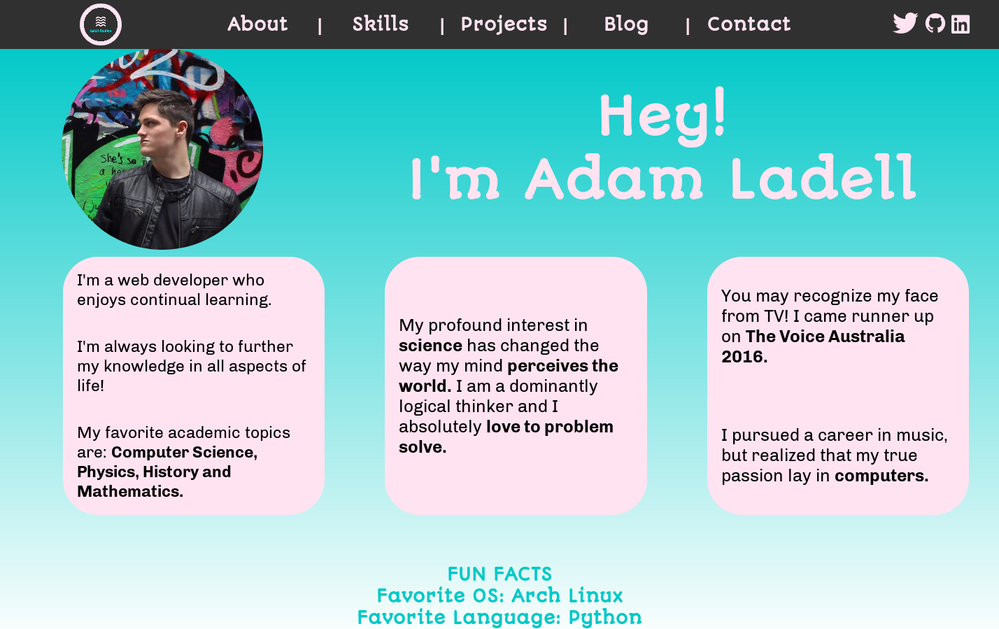

The about me section uses a **teal to white gradient** as the background to add style that is consistent with the rest of the section.  

The section is made up of a 9x9 grid with each element being distributed unevenly.

The portrait is contained in the upper left-most section with a border radius of 50%.

A title using the font selected for my headers is located over both the 2nd and 3rd column of the 1st row.

3 Containers are then found on the 2nd row, each which contain a seperate section of personal information about myself. The containers are each located within a parent div that encompasses the entirety of the grid allocation each of which are flexboxes. The containers are justified as ```flex-end```, ```center``` and ```flex-start``` accordingly.

Some fun facts are displayed below the main content.

#### Skills

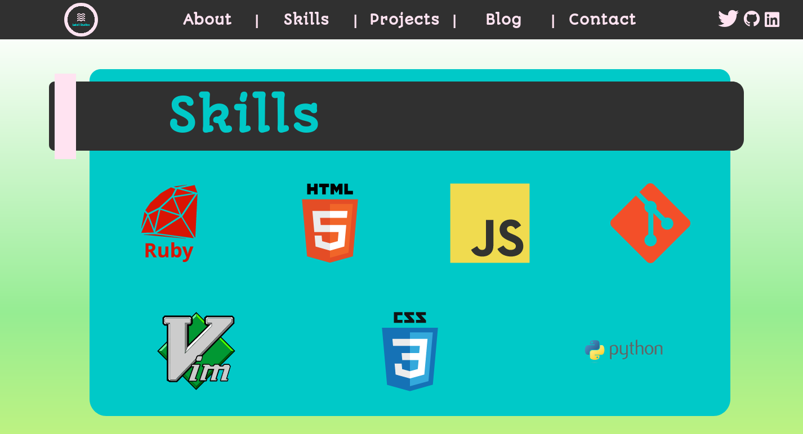

The skills section is designed as an object located in the center of the section that has subtle rounded corners and a banner at the head.

The skills section consists of two main elements.

* Banner  
The banner was created using a complex grid system along with flex-box. It consists of the top blue division, the pink banner, the 4 seperate granite divisions and the bottom blue division. A title is included in the 3rd granite division and uses ```justify-content: flex-start```.

* Content
The content of the skills section consists of a logo, each of which correlates to a skill that I have obtained along my programming career. The content division uses a 12x2 grid system with each logo in the top row taking up 3 columns and each of the bottom logos taking up 4 rows. Each of the logos has incorporated an animation that causes the element to rotate back and forth by 10 degrees.


The background of the Skills section and the Projects section consists of a white, green, yellow, green, white linear gradient.

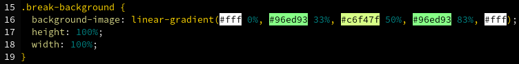

#### Projects

The projects section uses the same banner/content design as before while utilising a 3x2 grid system. Each project is allocated it's own div that includes the project header and an image of the project. The images act as links to redirect the user to the project in a new tab.
The project images have a hover animation that increases the border radius from 0% to 25%.
```
@keyframes project-hover {
  0%   { border-radius: 0; }
  100% { border-radius: 25%; }
}
```

Three additional project spots have been left blank with a title of 'Coming Soon' to accomodate for additional projects and to allow users of the site to be informed that I am currently working on projects.

#### Contact Me

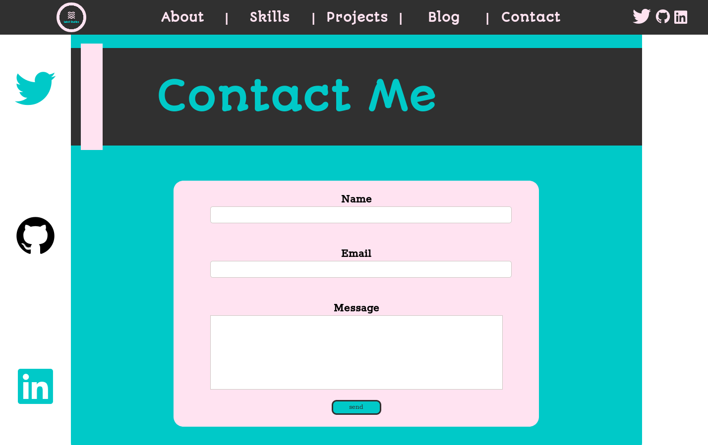

The contact section uses a modified version of the banner/content design as the previous two sections. The blue background now spans the entirety of the banner. A social sidebar is also included adjacent to the contact me section to encourage users to visit my various social media profiles. Each social icon incorporates the same animation as the ones in the navbar.  
The contact me section includes an email form with inputs for the user's Name, Email and Message.
The submit button uses an animation upon hovering over it to give the impression that the button is being pushed in using ```box-shadows``` and different ```bottom``` and ```top``` postional values.
Pressing the submit button causes a POST request to be sent to [formspree.io](https://formspree.io) which then redirects the contents of the form to my email.


### MOBILE SPECIFICS

The mobile version of the site includes quite a few changes from the original site.

#### Landing Page

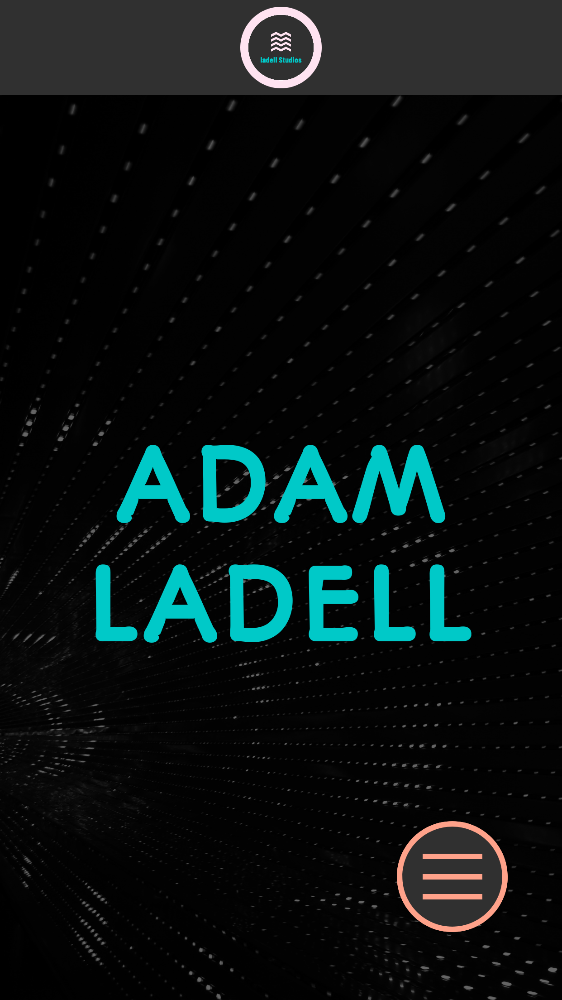

The landing page now has the title word wrapped and has a dynamic font size depending on the width of the device. 

#### Navbar

The navbar is now a static div consisting of only the logo of the site, centered in the middle. The height is responsive to the device width.

#### Floating Hamburger Menu

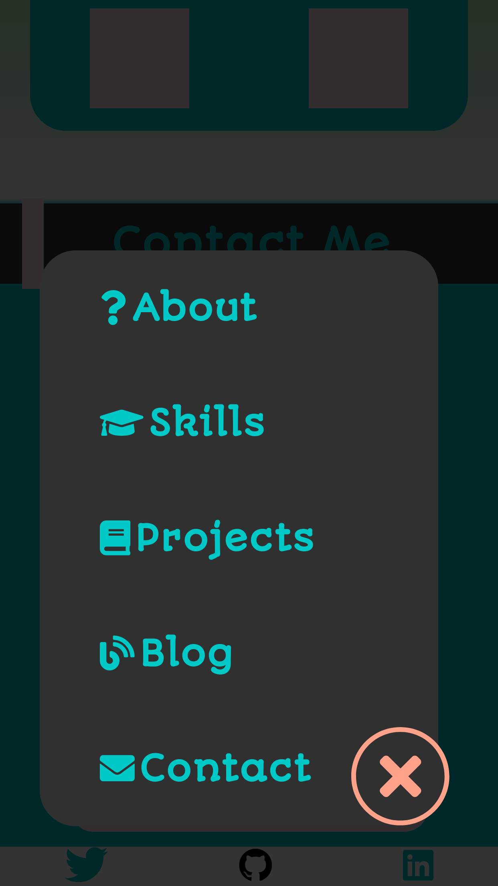

The navigational system of the desktop site has been replaced with a floating hamburger menu in the mobile site. The menu icon uses a fixed div placed in the bottom right of the screen.
It uses a checkbox with ```opacity: 0;``` to allow the user to touch it and recieve a response.

Upon touching the hamburger button, a navigational menu floats in from the bottom as well as an exit button which floats in from the right. The menu consists of each of the previous navigational links as well as icons related to the names of each link. 

An animation is included for the touching of the links. The nth-child() selector was used to allow the top and bottom animation would have rounded top and bottom corners respectively.

#### About Me

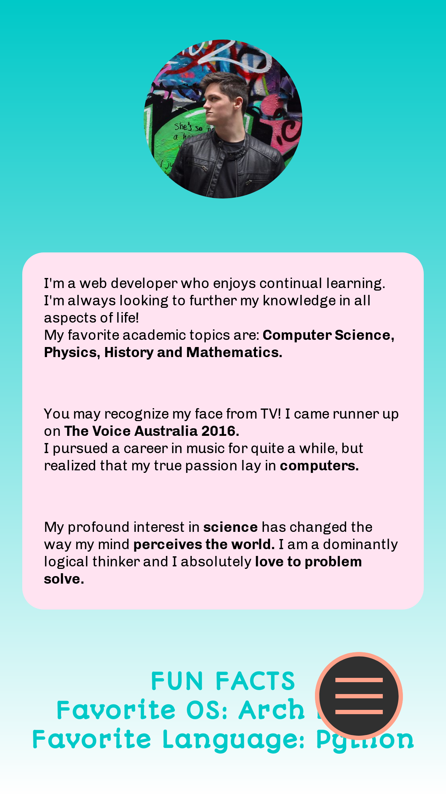

The about me section on mobile hides the Header text and centers the portrait image at the top of the screen. The content has also been changed to a single container holding all the text. The fun facts are still visible underneath the container.

#### Skills

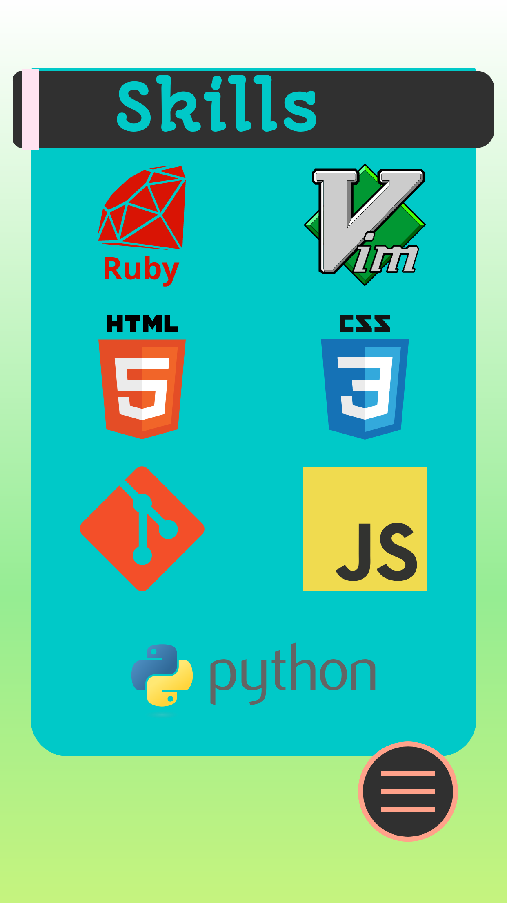

The skills section uses the same structure as the desktop version, except for a restructured banner that changes the location of the pink banner and various dimensions. The content is now structured in a 2x4 grid to allow for a more vertical display of the icons. 

#### Projects

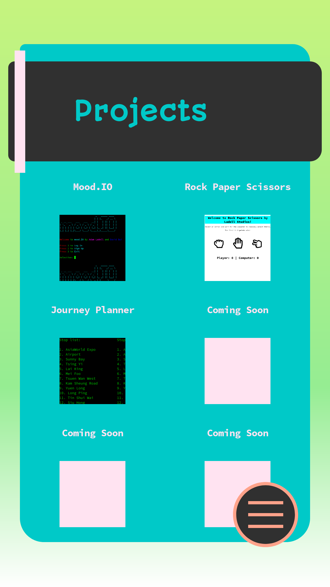

The projects section uses the same structure as the mobile Skills page whilst utilising a 2x3 grid for the projects. The grid and it's elements scale depending on the width of the device being used.

#### Contact Me

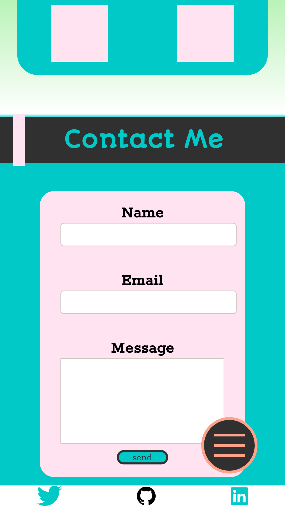

The contact me section uses the same banner as the desktop version however the social sidebar is now included below the contact me section as a footer.

## Tech Stack
The site was developed using the following tech stack:
* HTML5
* CSS3
* GitHub Pages

## Sitemap
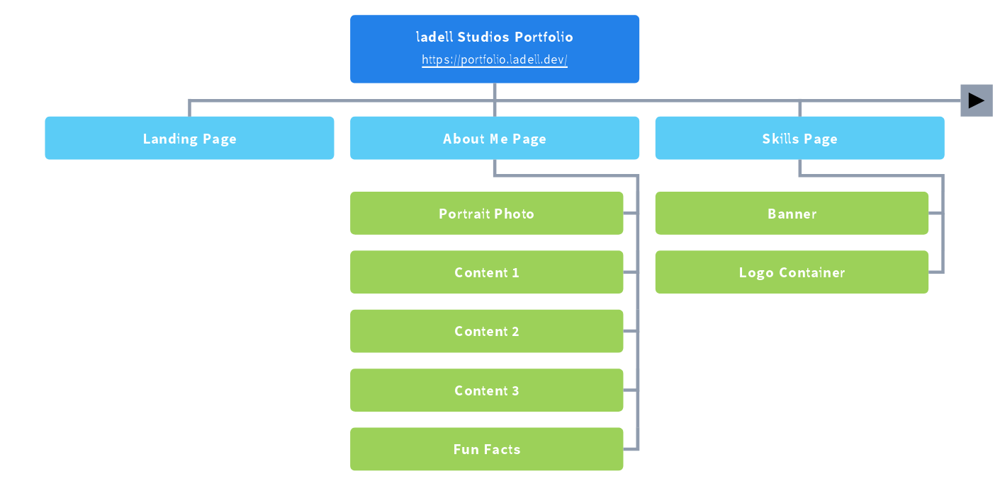


## Design Process / Wireframes
[Check it out here!](https://www.figma.com/file/KHAkXjgVHwU5mc4kUuk1mnU4/Adam-Ladell-Portfolio?node-id=0%3A1)

## Usability Considerations
Responsiveness was included to allow a multitude of devices to be used to view my website.
Alt text was also added to images to increase accessibility.
Colors with high contrast were also chosen to allow visually impaired users to access the content on the site easily.

## Timeline
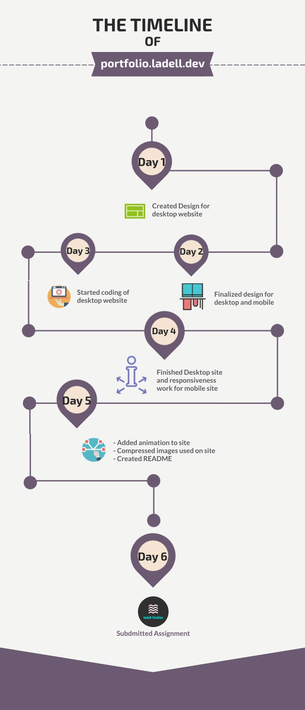

## Trello Board
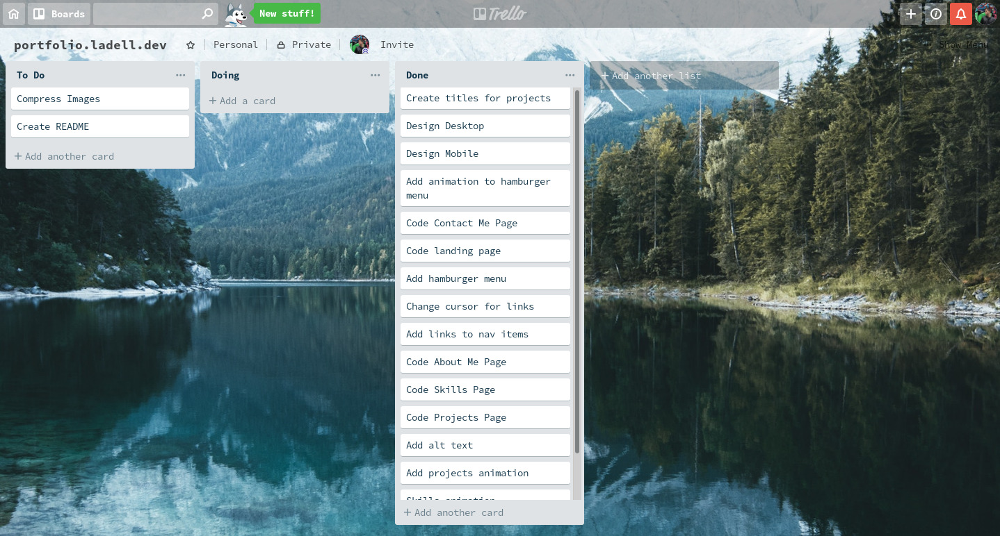


## Q & A
**Describe the key events in the development of the internet from the 1980s to today**

1981 - National Science Foundation provides grant to set up the Computer Science Network

1982 - TCP/IP become the protocol for the ARPANET

1983 - The Domain Name System creates .org .com .net and others for naming websites instead of using their IP address.

1985 - Symbolics.com becomes the first registered domain

1990 - Tim Berners-Lee develops HyperText Markup Language

1991 - World Wide Web introduced to the public

1993 - The UN and White House establish themselves online

1998 - Google is created

2004 - Facebook goes online

2009 - The World Wide Web hits it's 40th anniversary

2010 - Instagram launched

2019 - The World Wide Web hits it's 50th anniversary

**Define and describes the relationship between fundamental aspects of the internet such as: domains, web servers, DNS, and web browsers**

When a user opens their web browser (a software application designed to access information on the World Wide Web most commonly using the HyperText Transfer Protocol to get said information and display it to the user using it's rendering engine) they are able to access a web server (A computer that accepts World Wide Web client requests and returns information over HTTP and other related protocols) located anywhere in the world by entering the URL of a website (A URL consists of a domain name, which is a label that identifies which group of domains the site is registered under such as .com, .org, .net etc.). The request is then sent to a Domain Name Server that searches through their database to find the IP address associated with the URL.

**Reflect on one aspect of the development of internet technologies and how it has contributed to the world today**

The Domain Name System introduced the .com, .org, .net and many other domains in 1983. Before the DNS was around, web servers could only be accessed on the network using their relevant Internet Protocol address. Following the implementation of DNS, people were now able to register their web server's IP address under a domain name of their choosing. This allowed users wanting to connect to their site the ability to enter a more human-readable address to connect to that was relevant to the site. These days, almost all web services are assigned a domain name for users to connect to. This has greatly increased the ability to share websites and for marketing of websites to become exponentially more efficient.
